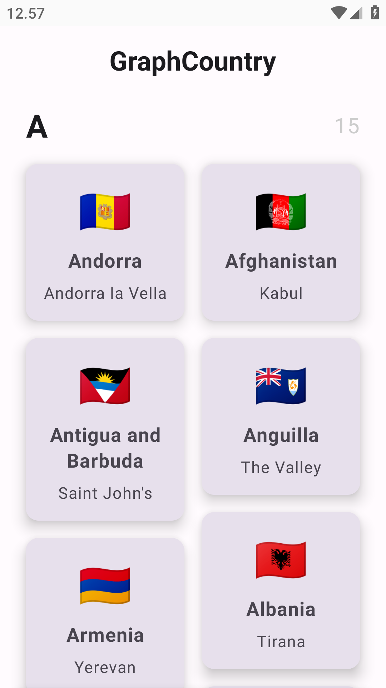
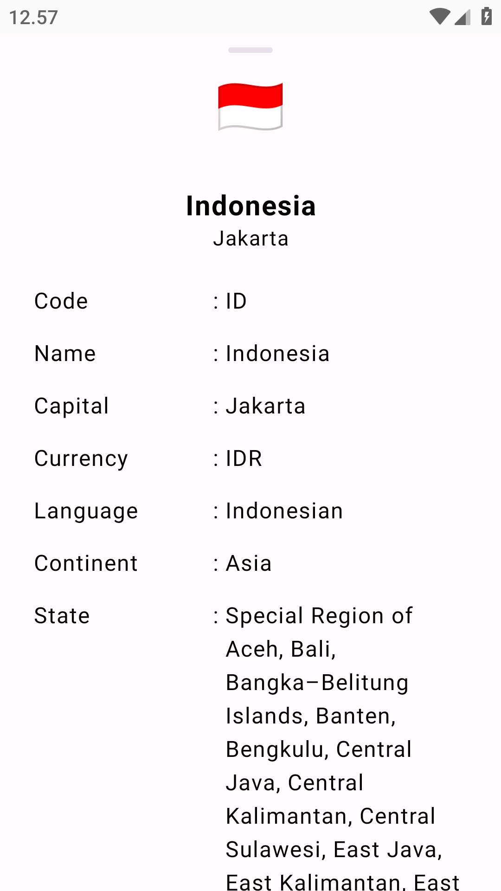
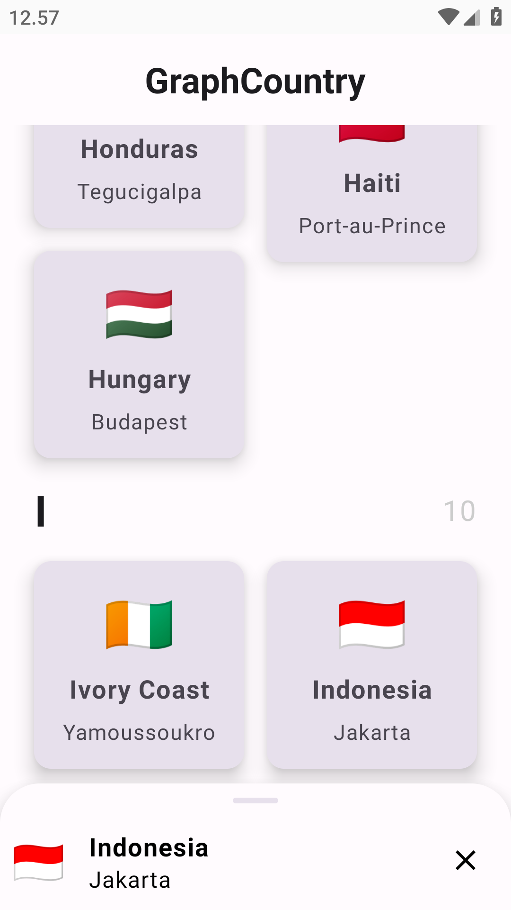

<div align="center">
    <h1>GraphCountry</h1>
    <p>An Android application for showing Countries</p>
</div>

---

<p align="center">
  
  
  
</p>

## Features
- Showing list countries
- Detail country

## Library
1. [Hilt](https://dagger.dev/hilt/) for Dependency Injection
2. [ApolloGraphQL](https://www.apollographql.com/docs/kotlin/tutorial/00-introduction/) for GraphQL Client)
3. Used AndroidX, Jetpack Compose, Material Design Components 2 & 3, ViewModel, and any more libraries

## Data Source
- [Countries GraphQL API](https://countries.trevorblades.com/graphql)

## Note
[Apollo Kotlin]((https://www.apollographql.com/docs/kotlin/tutorial/02-add-the-graphql-schema/#download-your-servers-schema)) 
requires a schema to generate type-safe models and code from your queries. From the root of the project,
run the following in Android Studio's Terminal tab:
```./gradlew :app:downloadApolloSchema --endpoint='<url>' --schema=<location>```